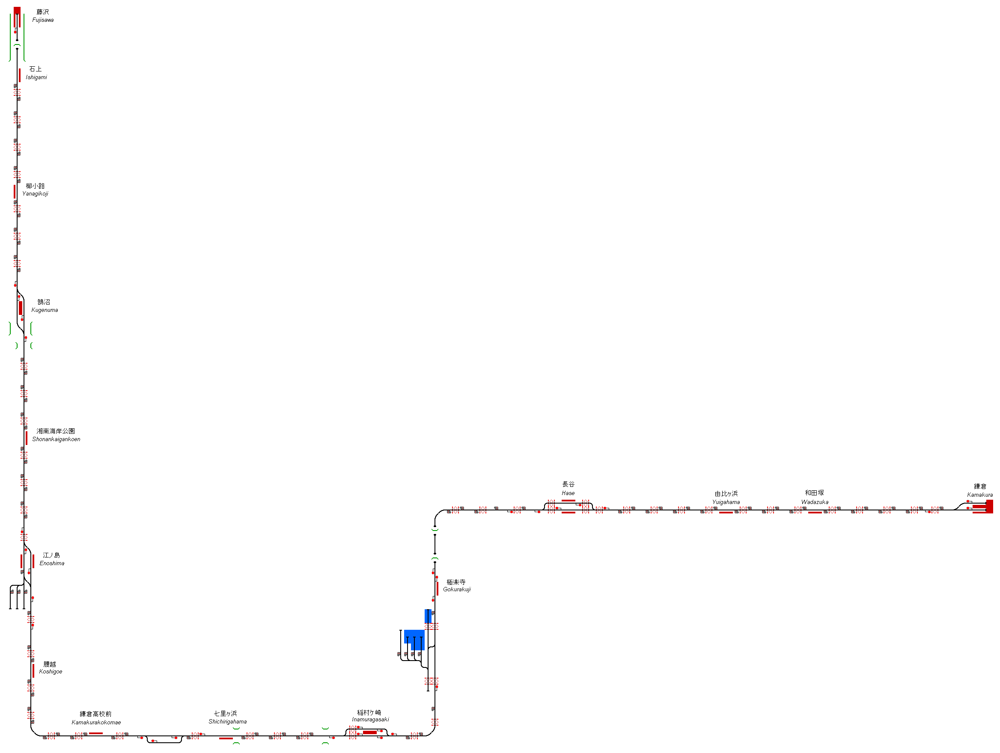

# Enoshima Electric Railway
The Enoshima Electric Railway is a private railway running along the south coast of Japan, connecting Kamakura with Fujisawa.

## Current Status

| Stage         | Status        |
| ------------- |:-------------:|
| Track Plan     |  |
| Signalling      |       |
| Naming |       |
| Speed Limits |  |
| Distances |  |
| Timetable |  |
| Documentation |  |

## Data Sources

- [4K cab view - Enoshima Electric Railway Kamakura to Fujisawa with a view of the sea and Mt FUJI](https://www.youtube.com/watch?v=9-Dt3sAdK2s&t=252s) by AUNZ RAILFAN
- [4K Japan Train Ride - Enoden 江ノ電 from Fujisawa 藤沢 to Kamakura 鎌倉 - 4K 60 FPS - June 2020 - Slow TV](https://www.youtube.com/watch?v=Hs8fD4fzsFc&t=291s) by Tokyo Explorer

Status icons by Freepik, pixelmeetup, Pixel Perfect on FlatIcon.com.
